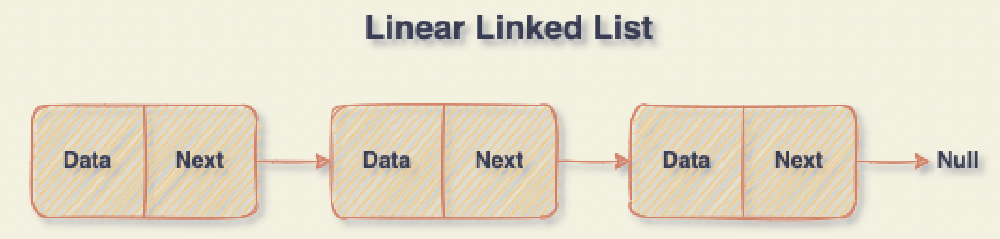
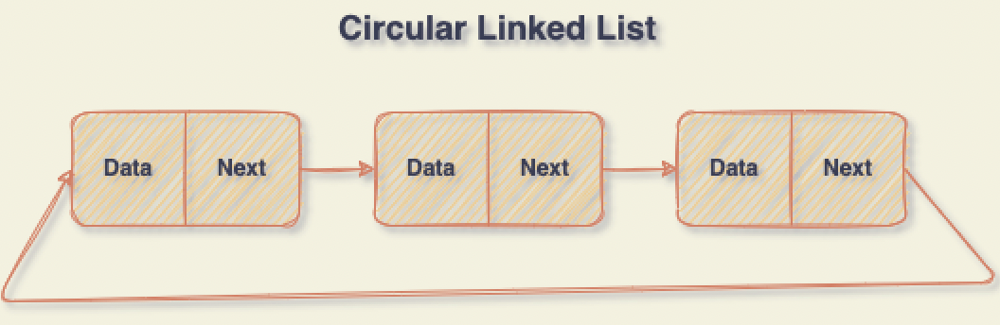
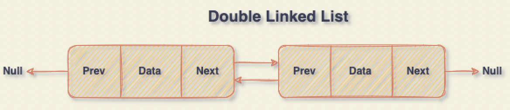

# Data Structures With Go

### Linked List


```go
type linear struct {
    Data    int
    Next *linear
}
```


```go
type circular struct {
    Data    int
    Next *circular
}
```


```go
type double struct {
    Data    int
    Next *double
    Prev *double
}
```

## Queue
- Array Queue
```go
type arrayQueue struct {
    Arr []int
    ArrSize int
    FirstIndex int
    LastIndex int
}
```
- Linked List Queue
```go
type linkedListQueue struct {
    X int
    Next *linkedListQueue
}
```

## Stack
- Array Stack
```go
type arrayStack struct {
    Arr []int
    ArrSize int
    Index int
}
```
- Linked List Stack
```go
type linkedListStack struct {
    X int
    Next *linkedListStack
}
```

### Source
[](https://bilgisayarkavramlari.com/category/veri-yapilari/)
<a href="https://www.geeksforgeeks.org/data-structures/linked-list/">
</a>
